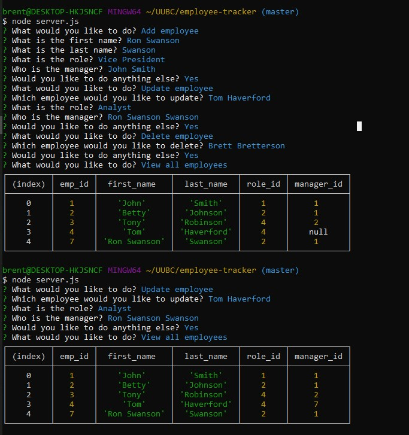

# Employee Tracker

### Summary
This app allows a person to view, add and delete departments and roles as well as view, add, update and delete employees from the database.    

[Video to Demonstration](https://drive.google.com/file/d/1QSVoRdg5z_sogxxCEV0CPBM_P_ule1xe/view) 

### User Story 
As a business owner I want to be able to view and manage the departments, roles, and employees in my company So that I can organize and plan my business

### Description
A command-line application that allows the user to:

  * Add departments, roles, employees

  * View departments, roles, employees

  * Update employee roles and managers

  * Delete departments, roles, and employees

### Future Development
  * View departments by salary expense

  * View employees by manager

